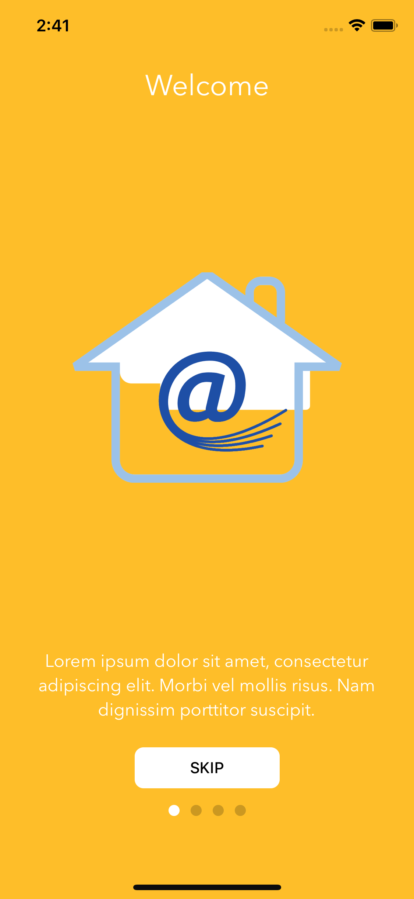

# react-native-js-app-tutorial

A library for React Native to build a tutorial intro.

## Getting started

```sh
$ yarn add react-native-js-app-tutorial
```

## Usage

`react-native-js-app-intro` has ready templates to show pages. You can import `Slide`, a template prepared to show a slide with a default style. If you prefer, you can provide your own template. Just make sure that it belongs to `IntroSlider` component (as child).

<p align="center">

</p>

You can also override the default skip button, passing a `skipButton` prop to `IntroSlider`.

```js
/* @flow */

import React, { Component } from 'react'
import { StyleSheet } from 'react-native'
import { IntroSlider, Slide } from 'react-native-js-app-tutorial'

type Props = {
  navigator: Object
}

class Example extends Component<Props> {
  _onSkip = () => {
    console.log('onSkip pressed')
  }

  render() {
    return (
      <IntroSlider
        onSkip={this._onSkip}
        activeDotStyle={styles.activeDot}
        showSkipButton={true}
        skipTitleButton="SALTAR"
        skipLastTitleButton="SIGUIENTE"
        tintStatusBar={true}
        animationType={'Pager'}>
        <Slide
          image={{
            uri:
              'https://www.electricasollerense.es/media/gasb2c/filer_public_thumbnails/filer_public/2014/04/11/fibra-logo-domestica.png__1618x1231_q85_crop_subsampling-2_upscale.png'
          }}
          title="Welcome"
          description="Lorem ipsum dolor sit amet, consectetur adipiscing elit. Morbi vel mollis risus. Nam dignissim porttitor suscipit."
          backgroundColor="#FEBE29"
          titleStyle={styles.title}
          imageStyle={styles.image}
          descriptionStyle={styles.description}
        />
        <Slide
          image={{
            uri:
              'https://www.electricasollerense.es/media/gasb2c/filer_public_thumbnails/filer_public/2014/04/11/fibra-logo-domestica.png__1618x1231_q85_crop_subsampling-2_upscale.png'
          }}
          title="Welcome 2"
          description="Lorem ipsum dolor sit amet, consectetur adipiscing elit. Morbi vel mollis risus. Nam dignissim porttitor suscipit."
          backgroundColor="#CD5C5C"
          titleStyle={styles.title}
          imageStyle={styles.image}
          descriptionStyle={styles.description}
        />
        <Slide
          image={{
            uri:
              'https://www.electricasollerense.es/media/gasb2c/filer_public_thumbnails/filer_public/2014/04/11/fibra-logo-domestica.png__1618x1231_q85_crop_subsampling-2_upscale.png'
          }}
          title="Welcome 3"
          description="Lorem ipsum dolor sit amet, consectetur adipiscing elit. Morbi vel mollis risus. Nam dignissim porttitor suscipit."
          backgroundColor="#6495ED"
          titleStyle={styles.title}
          imageStyle={styles.image}
          descriptionStyle={styles.description}
        />
      </IntroSlider>
    )
  }
}

const styles = StyleSheet.create({
  activeDot: {
    backgroundColor: 'white'
  },
  title: {
    fontFamily: 'AvenirNext-Bold'
  },
  description: {
    fontFamily: 'Avenir Next'
  },
  image: {
    width: 250,
    height: 250
  }
})

export default Example
```

## API

|        Prop         |     Type      | Required |                                                                  Description                                                                  |
| :-----------------: | :-----------: | :------: | :-------------------------------------------------------------------------------------------------------------------------------------------: |
|        page         |    number     |    No    |                                                 Index of initial page that should be selected                                                 |
|       onSkip        |   Function    |    No    |                                            Function to execute when default skip button is pressed                                            |
|   activeDotStyle    |    Object     |    No    |                                                   Styles object of active dot at the bottom                                                   |
|  inactiveDotStyle   |    Object     |    No    |                                                  Styles object of inactive dot at the bottom                                                  |
|   skipTitleButton   |    string     |    No    |                                                           Title of the skip button                                                            |
| skipLastTitleButton |    string     |    No    |                                             Title of the skip button when last page is displayed                                              |
|     skipButton      | React.Element |    No    |                                    Display a custom skip button component to override the default template                                    |
|    animationType    |    string     |    No    | Choose a predefined animation to apply on ScrollView's children (default: `Pager`, types: Pager, ZoomOut, TranslateY, RotateX, RotateY, Flip) |
|   customAnimation   |    Object     |    No    |                                              Custom animation to apply on ScrollView's children                                               |

## TODO

* [x] Default and custom animations
* [ ] Tests

## License

MIT License

Copyright (c) 2018 InterfaceKit

## Author

Antonio Moreno Valls `<amoreno at apsl.net>`

Built with 💛 by [APSL](https://github.com/apsl).
